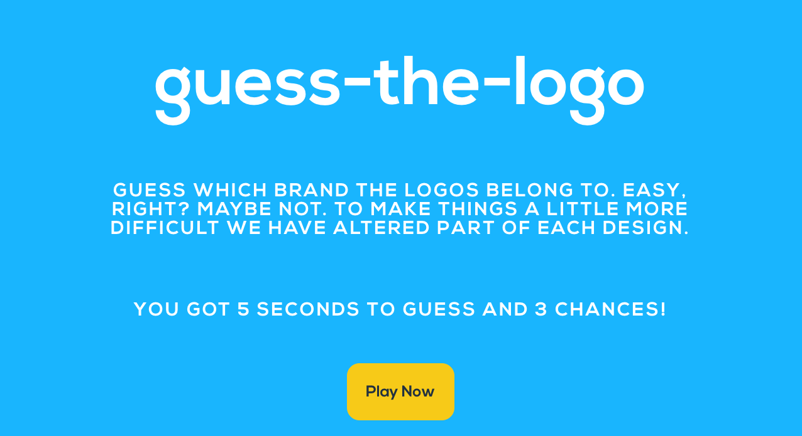
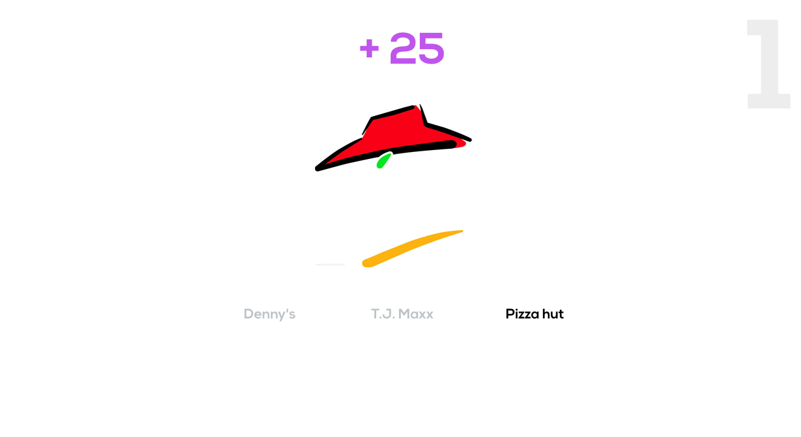

# guess-the-logo

## What is guess-the-logo?

A game that tests your branding knowledge. A set of logos that have been altered (to make it more difficult to guess) will display along with a set of answers to pick and you'll have to guess which brand they belong to.

## Technical Discussion

- HTML
- CSS
- JavaScript
- jQuery

## User Story

- The user will be greeted with a flat design style screen that displays the name of the game along with some lines on how to play it and a button that will start the game.

- The user will be given a set of three answers to choose from and a timer of 5 seconds for every logo to guess

- The user gets three chances and they will loose the game if the timer reaches zero or they pick the wrong answer

## The Making of guess-the-logo

Even though it is a very simple game, it was challenging for me to code. I had difficulty clearing the interval of my timer and still could not make it clear it. I get to put into practice what I've learnt so far but I still am very far from where I'd have liked to have my game completed. I definitely loved using jQuery to create and manipuate the DOM, I enjoy using jQuery soo much!

## Opportunities for Future Growth
- Consolidate my code/ dryer code
- Use of class and prototype
- Practice and practice more 
