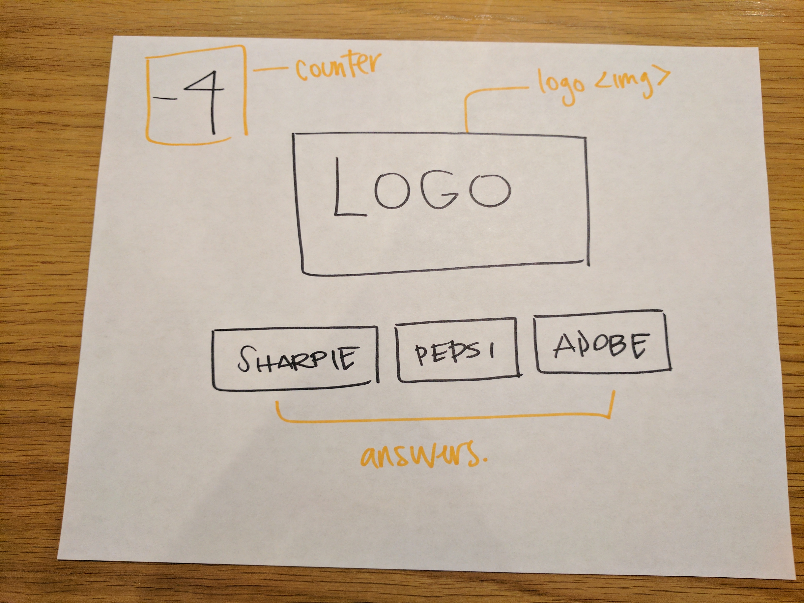
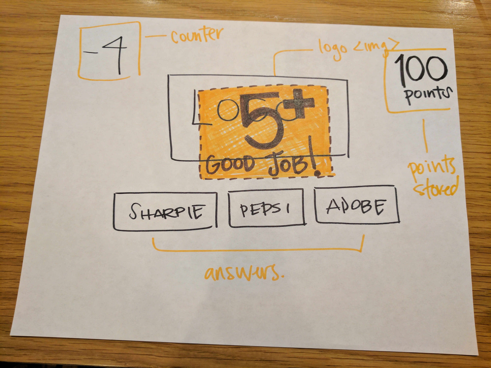

*** Briseida Montiel / 7/11/17 ***

# Guess The Logo Proposal

## What is Guess The Logo?

A game that tests your branding knowledge. A set of logos that have been altered (to make it more difficult to guess) will display along with a set of answers to pick and you'll have to guess which brand they belong to.

## Wireframe

## Initial thoughts on game structure

- create the DOM dynamically 
- set a timer to guess the logo
- local storage

## Phases of Completion

- Create wireframe
- Pseudo code 
- Functionality - are images loading properly AND answers being submitted via button correctly matching the name of the image. This is how a player earns points. 
- Is the local storage method correctly saving scores.

## Links and Resources

(http://www.guessthelogo.com/)